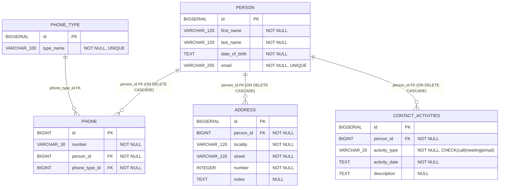

# Emergencias Backend Challenge

Esta API fue diseñada como una base backend reutilizable y escalable, pensada para servir como scaffolding de futuros proyectos: una estructura lista para crecer, con convenciones claras, separación de responsabilidades y un flujo de trabajo consistente desde el inicio. Sobre esa base, implementa un sistema de gestión de contactos orientado a escenarios reales, modelando personas con múltiples teléfonos y direcciones, junto con actividades de seguimiento como llamadas, reuniones y emails, priorizando trazabilidad funcional y consistencia de datos en cada endpoint.

La solución fue desarrollada con Node.js, Express y TypeScript, aplicando una arquitectura por capas para desacoplar reglas de negocio, transporte HTTP y persistencia SQL. Se incorporó validación estricta con Zod para garantizar contratos de entrada tipados y predecibles, respuestas HTTP estandarizadas para simplificar la integración desde clientes, y manejo centralizado de errores para exponer fallas técnicas de forma consistente.

Además, se configuraron entornos separados para desarrollo y testing de integración utilizando bases de datos independientes, permitiendo validar escritura real, relaciones entre entidades y comportamiento transaccional sin depender de mocks. El proyecto también prioriza buenas prácticas de mantenibilidad, tipado estricto, uso correcto de verbos HTTP y status codes, junto con una estructura preparada para evolucionar con seguridad y sostener calidad técnica a largo plazo.

## Instalacion y primer arranque

### 1) Requisitos

- Node.js 20+
- Docker

### 2) Instalar dependencias

```bash
npm install
```

### 3) Configurar entorno

```bash
copy .env.example .env
copy .env.example .env.test
```

Archivos:

- `.env`: variables para desarrollo (`npm run dev`)
- `.env.test`: variables para testing (usado automaticamente por los scripts de test)

Cada archivo debe tener su propia `DATABASE_URL`:

- `.env` → `DATABASE_URL` (puerto 55434 - dev)
- `.env.test` → `DATABASE_URL` (puerto 55435 - test)

Variables principales:

- `PORT`: puerto HTTP de la API
- `DATABASE_URL`: conexion a base de datos (cada archivo tiene la suya)
- `INTEGRATION_TESTS`: habilita tests de integracion (solo en `.env.test`)

### 4) Levantar base de desarrollo

```bash
npm run db:up
```

### 5) Levantar API

```bash
npm run dev
```

Accesos:

- API: `http://localhost:3001`
- Swagger: `http://localhost:3001/docs`

---

## Por que hay dos bases (dev y test)

Se definieron dos servicios Postgres separados:

- `emergencias-postgres-dev` (`55434`, DB `emergencias_dev`)
- `emergencias-postgres-test` (`55435`, DB `emergencias_test`)

Objetivo:

- poder desarrollar y probar manualmente sin afectar datos de tests;
- ejecutar pruebas de integracion que escriben y limpian datos reales;
- validar todos los endpoints end-to-end sin necesidad de mockear persistencia.

Esto permite comprobar comportamiento real de validaciones, constraints, relaciones y consultas SQL.

---

## Arquitectura y decisiones tecnicas

Arquitectura por capas:

- `routes`: define endpoints y middlewares
- `controllers`: entrada/salida HTTP
- `services`: reglas de negocio
- `repositories`: acceso SQL
- `shared`: utilidades comunes (errores, logging, respuestas)

Patrones aplicados:

- Repository Pattern
- Service Layer
- Validacion en borde con Zod
- Mapeo centralizado de errores SQLSTATE

---

## Modelo de datos

Tablas implementadas:

- `person`
- `phone`
- `phone_type`
- `address`
- `contact_activities`

Reglas clave:

- `person.email` unico
- `contact_activities.activity_type` restringido a `call | meeting | email`
- FKs con `ON DELETE CASCADE` para mantener integridad

Diagrama entidad-relacion (MERMAID):



---

## Estandar de respuestas

Se usa un contrato uniforme:

- exito: `{ "data": ..., "error": null }`
- error: `{ "data": null, "error": { "message": "...", "code"?: "...", "details"?: ... } }`

Esto simplifica el consumo desde frontend o clientes externos.

---

## Errores de base centralizados

Los SQLSTATE se centralizan en:

- `src/shared/errors/db-error-codes.ts`
- `src/shared/errors/db-error-mapper.ts`

Ejemplos:

- `23505` -> email duplicado (`409`)
- `23503` -> entidad relacionada no encontrada
- `23514` / `22P02` -> datos invalidos (`400`)

---

## SQL por modulo

Consultas separadas en archivos para facilitar mantenimiento y pruebas:

- `src/modules/contacts/sql/*.sql`
- `src/modules/activities/sql/*.sql`

El loader usa cache y fallback `dist -> src`.

---

## Seeds

- Base local/CI: `infra/local/postgres/seed/default/*.sql`
- Carpeta reservada para snapshots sanitizados: `infra/local/postgres/seed/snapshots/*`

---

## Scripts

| Script                          | Descripcion                                                             |
| ------------------------------- | ----------------------------------------------------------------------- |
| `npm run dev`                   | Levanta la API en modo desarrollo con recarga automatica (`tsx watch`). |
| `npm run build`                 | Compila TypeScript a `dist/`.                                           |
| `npm run start`                 | Ejecuta build y luego levanta la API compilada.                         |
| `npm run db:up`                 | Levanta la DB de desarrollo (`emergencias-postgres-dev`).               |
| `npm run db:down`               | Detiene la DB de desarrollo.                                            |
| `npm run db:reset`              | Reinicia la DB de desarrollo desde cero (contenedor + volumen).         |
| `npm run db:test:up`            | Levanta la DB de test (`emergencias-postgres-test`).                    |
| `npm run db:test:down`          | Detiene la DB de test.                                                  |
| `npm run db:test:reset`         | Reinicia la DB de test desde cero para pruebas reproducibles.           |
| `npm run test`                  | Ejecuta la suite completa de tests con salida verbose.                  |
| `npm run test:unit`             | Ejecuta tests unitarios (modulos y shared).                             |
| `npm run test:integration`      | Ejecuta solo tests de integracion contra `.env.test`.                 |
| `npm run test:integration:full` | Resetea DB de test y luego ejecuta tests de integracion.                |
| `npm run test:coverage`         | Ejecuta tests con reporte de cobertura.                                 |
| `npm run lint`                  | Corre ESLint sobre todo el proyecto.                                    |
| `npm run lint:fix`              | Corre ESLint y aplica fixes automaticos cuando es posible.              |
| `npm run format`                | Formatea el proyecto con Prettier.                                      |
| `npm run format:check`          | Verifica formato sin modificar archivos.                                |

---

## Endpoints

- `POST /contacts`
- `GET /contacts/by-email?email=`
- `GET /contacts/search?firstName=&lastName=&dateOfBirth=&limit=&offset=`
- `GET /contacts/by-phone?number=&type=`
- `PATCH /contacts/:id`
- `DELETE /contacts/:id`
- `POST /activities`
- `GET /activities/search?personId=&activityType=`

Toda la documentacion de request/response, status codes y ejemplos se encuentra en Swagger:

- `http://localhost:3001/docs`

---

## Testing

Los scripts de test utilizan `dotenv-cli` para cargar automaticamente las variables desde `.env.test`, evitando hardcodear URLs en los scripts.

### Unit tests

Ejecucion:

```bash
npm run test:unit
```

Suites unitarias actuales:

- `tests/unit/modules/contact.service.unit.test.ts`
- `tests/unit/modules/activity.service.unit.test.ts`
- `tests/unit/shared.db-error-mapper.unit.test.ts`
- `tests/unit/shared.api-response.unit.test.ts`
- `tests/unit/shared.validate-request.unit.test.ts`
- `tests/unit/shared.logging.unit.test.ts`

Cobertura:

```bash
npm run test:coverage
```

### Integracion (sin mocks de DB)

Para ejecutar pruebas reales contra la base de test:

```bash
npm run db:test:up
npm run test:integration
```

Flujo completo recomendado:

```bash
npm run test:integration:full
```

Suites de integracion actuales:

- `tests/integration/contacts.integration.test.ts`
- `tests/integration/activity.integration.test.ts`
- `tests/integration/system.integration.test.ts`

Si la DB de test no esta levantada, el setup falla con mensaje explicito indicando:

- `npm run db:test:up`
- `npm run db:test:reset`

**Nota**: Los tests requieren que la variable `INTEGRATION_TESTS=true` este presente en `.env.test` (incluida por defecto en el archivo de ejemplo).
